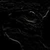
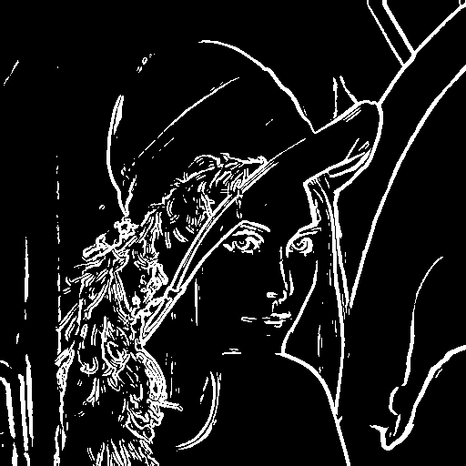
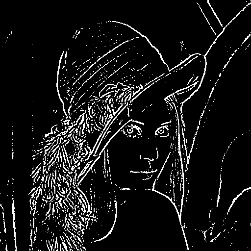
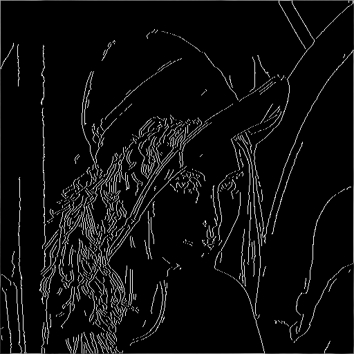
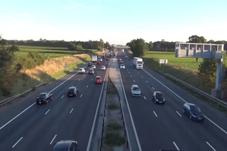

# Img Processing Demos

## Preview
### Wiki Kernels
| Identity                                     | Gradient                                          | Sharpen                                           | Box blur                                          | Gaussian blur 5 × 5                                    |   
| :--------------:                             | :--------------:                                  | :--------------:                                  | :--------------:                                  | :--------------:                                       |   
|  |  |   |  |  |   

### Edge Detection
| Identity                                     | Gradient                                          |                  Laplacian                                           | Canny                                                                                               |
| :--------------:                             | :--------------:                                  |                  :--------------:                                  | :--------------:                                                                                      |
|  |  |   |  |

### Change Detection
| Input                                     | Change Detection                                          |                  
| :--------------:                             | :--------------:                                  |                  
|  |  | 